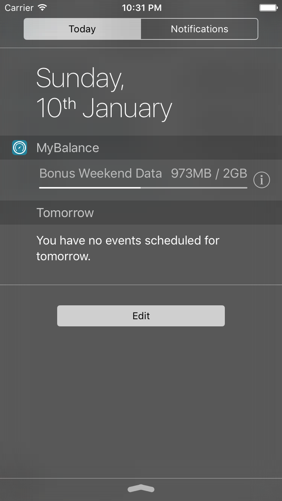
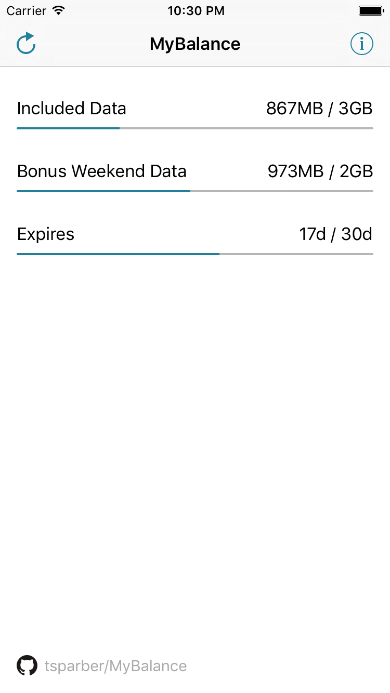

# MyBalance
Show current balance of your mobile plan on your iOS device as an app and a widget.

Currently supported:
* Boost Pre-Paid Mobile / [boost.com.au](http://boost.com.au)

Future plans:
* HoT - Hofer Telekom / [www.hot.at](https://www.hot.at)

 

App icon source: [openclipart.org gauge-icon](https://openclipart.org/detail/213224/gauge-icon). Thanks!
